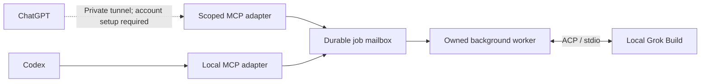

<p align="center">
  
</p>

<h1 align="center">ChatGPT Grok Bridge</h1>

<p align="center">
  <strong>A private connection from ChatGPT to your local Grok Build.</strong><br>
  Start a task. Follow its progress. Stay in control.
</p>

<p align="center">
  <a href="https://github.com/luohui1/chatgpt-grok-bridge/actions/workflows/tests.yml"></a>
  <a href="LICENSE"></a>
  
  
  
</p>

<p align="center">
  <a href="#quick-start">Quick start</a> ·
  <a href="#how-it-works">Architecture</a> ·
  <a href="#toolbox">Toolbox</a> ·
  <a href="SECURITY.md">Security</a> ·
  <a href="README.zh-CN.md">简体中文</a>
</p>

---

An open-source, unofficial plugin bridge that connects ChatGPT to the Grok Build
CLI on your own Windows machine through **OpenAI Secure MCP Tunnel** and **native
ACP**. A direct local MCP entry point also supports Codex.

> [!IMPORTANT]
> **Local integration tested. ChatGPT cloud end-to-end connection not yet verified.**
> ChatGPT requires separate tunnel permissions, account setup and a running local
> client. This project is not affiliated with or endorsed by OpenAI or Grok/xAI.

## Why this bridge?

| Capability | What it gives you |
| --- | --- |
| **Native protocol** | ACP over stdio, not terminal screenshots or simulated keystrokes. |
| **Durable background jobs** | An immediate job ID, incremental results and explicit command receipts. |
| **Session control** | Follow-up messages, cancellation, permission responses, close and explicit recovery. |
| **Local ownership** | Workspace locks, owned-process cleanup and per-job runtime snapshots. |
| **Private ChatGPT entry point** | Workspace aliases, client-scoped task visibility and paginated full results. |

Grok stays on your machine. Prompts and tool results still travel through the
configured services; **local execution does not mean offline inference**.

## Quick start

**Requirements:** Windows, Python 3.11+, the official Grok Build CLI, and your own
working Grok login. No CLI binaries, credentials or model credits are included.

### ChatGPT

Prepare the local adapter:

```powershell
git clone https://github.com/luohui1/chatgpt-grok-bridge.git
cd chatgpt-grok-bridge
python plugins/grok-subagent/scripts/chatgpt_setup.py init
python plugins/grok-subagent/scripts/chatgpt_setup.py install-client
python plugins/grok-subagent/scripts/chatgpt_setup.py status
```

Then follow the **[private ChatGPT setup guide](plugins/grok-subagent/CHATGPT.md)**
to select a workspace, configure your actual tunnel and connect your ChatGPT
account. Preparation alone does not establish a cloud connection.

> [!WARNING]
> No workspace is enabled by default. Enabling execution lets Grok act with your
> local account's privileges. This is **not an OS sandbox**. Keep the tunnel
> private and owner-only.

### Codex

Install the local MCP plugin from this repository's marketplace:

```powershell
codex plugin marketplace add luohui1/chatgpt-grok-bridge
codex plugin add grok-subagent@grok-subagent-community
```

Open a new Codex task to load the plugin. Avoid enabling a second copy from
another marketplace. The internal `grok-subagent` ID is retained for compatibility.

### Your first task

Ask your connected assistant:

> Use Grok in the workspace I authorize to inspect the test setup.
> Do not modify files. Start it in the background and report its findings.

The assistant should check `grok_doctor`, start the authorized task, preserve its
job ID, and read the result. In ChatGPT, it first discovers the configured aliases
with `grok_workspaces`.

## How it works



The mailbox uses SQLite WAL. Each worker starts an independent Grok session and
keeps its own Python runtime snapshot. A client disconnect does not itself cancel
the job. Recovery verifies recorded process identities instead of guessing from
a stale heartbeat.

Native integration mode disables Cursor/Claude MCP scanning for the child
process. Grok-native, plugin and managed integrations can still apply.

Read the [architecture notes](plugins/grok-subagent/RESEARCH.md) for the boundaries
between transport, job state and process lifetime.

## Toolbox

| Tool | Purpose |
| --- | --- |
| `grok_start` | Start an authorized job or explicitly resume a recorded session. |
| `grok_read` | Read status, incremental events and command receipts. |
| `grok_send` | Continue an idle session. |
| `grok_interrupt` | Cancel the current turn without pretending to undo side effects. |
| `grok_permission` | Respond to a real permission request within the user's authorization. |
| `grok_close` | Close the job and its owned processes. |
| `grok_recover` | Recover stale job state only after verifying the recorded processes stopped. |
| `grok_list` | List recent jobs visible to the entry point. |
| `grok_doctor` | Check the local CLI and compatibility baseline. |
| `grok_workspaces` | **ChatGPT:** discover locally configured workspace aliases. |
| `grok_result` | **ChatGPT:** read full textual results in bounded pages. |

## What is verified?

| Layer | Current evidence |
| --- | --- |
| Automated control and isolation | Windows CI on Python 3.11 and 3.12; no Grok install or credentials required. |
| Live Grok lifecycle | Recorded local checks for follow-ups, cancellation, file write/read, close and resume. |
| Process failure handling | Recorded local supervisor-crash, descendant cleanup and stale-job recovery checks. |
| ChatGPT adapter | Real local stdio-to-Grok smoke test, including result retrieval and scoped task visibility. |
| ChatGPT cloud connection | **Not yet verified end to end.** |
| Multi-day uptime / Linux / macOS | **Not claimed.** |

The tested CLI baseline is **Grok Build 1.0.13**, not a promise of compatibility
with every future CLI release. The latest automated status is shown by the CI badge.

## Development

Run the isolated test suite without Grok or model quota:

```powershell
python -m unittest discover -s plugins/grok-subagent/tests -v
```

<details>
<summary>Optional live tests: use your own login and model quota</summary>

```powershell
python plugins/grok-subagent/tests/live_smoke.py
python plugins/grok-subagent/tests/live_chatgpt.py
python -m pip install -r requirements-live.txt
python plugins/grok-subagent/tests/live_resources.py
```

These create isolated fixture tasks under your local data directory.
Their output is Git-ignored. Never commit task databases, logs or personal results.

</details>

Contributions are welcome. Start with [CONTRIBUTING.md](CONTRIBUTING.md) and keep
real model calls opt-in rather than running them automatically on pull requests.

## Security and limitations

- Workspace aliases, locks and permission prompts are **not filesystem confinement**.
- Grok runs with local-account access and may reach files or networks outside the selected directory.
- Cancellation does not roll back completed file changes or external requests.
- ChatGPT does not automatically wake up when a background task finishes.
- The tunnel client and your machine must remain online for cloud access.
- This is a single-owner tool, not a public or multi-user remote execution service.

See [SECURITY.md](SECURITY.md) before granting execution access.

## License

[MIT](LICENSE) for this project. The [original bridge mark](plugins/grok-subagent/assets/ASSETS.md)
is included with the project; official OpenAI and Grok artwork is not.
Third-party services, CLIs and trademarks retain their own terms.
