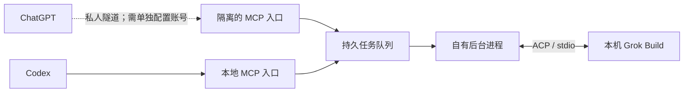

<p align="center">
  
</p>

<h1 align="center">ChatGPT Grok Bridge</h1>

<p align="center">
  <strong>让 ChatGPT 私人连接你本机的 Grok Build。</strong><br>
  后台执行，持续追问，随时掌握任务状态。
</p>

<p align="center">
  <a href="https://github.com/luohui1/chatgpt-grok-bridge/actions/workflows/tests.yml"></a>
  <a href="LICENSE"></a>
  
  
  
</p>

<p align="center">
  <a href="#快速开始">快速开始</a> ·
  <a href="#工作原理">工作原理</a> ·
  <a href="#工具一览">工具一览</a> ·
  <a href="SECURITY.md">安全说明</a> ·
  <a href="README.md">English</a>
</p>

---

一个开源、非官方的 ChatGPT 插件桥接器，通过 **OpenAI Secure MCP Tunnel**
和 **原生 ACP 协议**连接 Windows 本机的 Grok Build CLI，同时支持 Codex 本地 MCP。

> [!IMPORTANT]
> **本地集成已测试；ChatGPT 云端尚未完成端到端验证。**
> 你仍需单独配置隧道权限、账号连接，并保持本机客户端运行。
> 本项目与 OpenAI、Grok/xAI 无隶属或官方背书关系。

## 为什么做这个桥接器？

| 能力 | 解决什么问题 |
| --- | --- |
| **原生协议接入** | 使用 ACP stdio，不靠终端截图或模拟键盘操作。 |
| **持久后台任务** | 立即返回任务 ID，提供增量结果和明确的命令回执。 |
| **完整会话控制** | 追问、中断、权限回应、关闭和显式恢复。 |
| **本地任务管理** | 工作目录锁、自有进程清理和每任务运行代码快照。 |
| **ChatGPT 私人入口** | 目录别名、任务可见性隔离和完整文字结果分页。 |

Grok 运行在你的电脑上，但提示和工具结果仍会经过所配置的服务。
**本地执行不等于离线推理。**

## 快速开始

**前提：** Windows、Python 3.11+、官方 Grok Build CLI，以及你自己的有效 Grok 登录。
本项目不附带 CLI、账号、密钥或模型额度。

### 接入 ChatGPT

先准备本地入口：

```powershell
git clone https://github.com/luohui1/chatgpt-grok-bridge.git
cd chatgpt-grok-bridge
python plugins/grok-subagent/scripts/chatgpt_setup.py init
python plugins/grok-subagent/scripts/chatgpt_setup.py install-client
python plugins/grok-subagent/scripts/chatgpt_setup.py status
```

然后按 **[ChatGPT 私人接入指南](plugins/grok-subagent/CHATGPT.md)** 配置工作目录、
实际 Tunnel ID 和账号连接。只完成本地准备，不代表已经接通云端。

> [!WARNING]
> 默认不开放任何工作目录。启用执行后，Grok 使用本机账号权限运行。
> 这**不是操作系统沙箱**，隧道应仅供本人使用。

### 接入 Codex

```powershell
codex plugin marketplace add luohui1/chatgpt-grok-bridge
codex plugin add grok-subagent@grok-subagent-community
```

新开一个 Codex 任务以加载插件。不要同时启用其他来源的同名副本。
内部插件 ID `grok-subagent` 保持不变，以兼容已有安装。

### 第一个任务

向已连接的助手发送：

> 用 Grok 在我授权的工作目录里检查测试配置。不要修改文件，
> 先在后台执行，再告诉我检查结果。

助手应先调用 `grok_doctor`，再启动任务、保留任务 ID 并读取结果。
在 ChatGPT 中，先通过 `grok_workspaces` 获取本地已配置的目录别名。

## 工作原理



任务状态存放于 SQLite WAL。每个 worker 启动独立 Grok 会话，并保存自己的
Python 运行代码快照。客户端断连本身不会取消任务；失联恢复会核验记录中的
进程身份，不会因为心跳过期就猜测进程已经停止。

默认轻量模式仅对该子进程关闭 Cursor/Claude MCP 配置扫描；
Grok 自身、插件和受管集成仍可能生效。详见 [架构说明](plugins/grok-subagent/RESEARCH.md)。

## 工具一览

| 工具 | 用途 |
| --- | --- |
| `grok_start` | 启动已授权任务，或显式续接已记录的会话。 |
| `grok_read` | 读取状态、增量事件和命令回执。 |
| `grok_send` | 向空闲会话发送追问。 |
| `grok_interrupt` | 中断当前轮次，不冒充已经撤销副作用。 |
| `grok_permission` | 在用户授权范围内回应实际权限请求。 |
| `grok_close` | 关闭任务及其自有进程。 |
| `grok_recover` | 确认记录中的进程已停止后，恢复失联任务状态。 |
| `grok_list` | 列出该入口可见的近期任务。 |
| `grok_doctor` | 检查本机 CLI 和兼容基线。 |
| `grok_workspaces` | **ChatGPT 专用：** 获取本地配置的目录别名。 |
| `grok_result` | **ChatGPT 专用：** 分页读取完整文字结果。 |

## 验证到什么程度？

| 层次 | 当前证据 |
| --- | --- |
| 自动化控制与隔离 | Windows / Python 3.11、3.12 CI；无需 Grok 安装、账号或额度。 |
| 真实 Grok 生命周期 | 已记录本地追问、中断、文件写读、关闭和恢复检查。 |
| 进程故障处理 | 已记录后台管理进程崩溃、子进程清理和失联恢复检查。 |
| ChatGPT 适配器 | 本机 stdio 到真实 Grok 的测试，包括结果读取和任务可见性。 |
| ChatGPT 云端连接 | **尚未完成端到端验证。** |
| 多日连续运行 / Linux / macOS | **不作已验证承诺。** |

CLI 兼容基线为 **Grok Build 1.0.13**，不代表未来所有版本都兼容。
最新自动化测试状态以页首 CI 徽章为准。

## 开发与测试

普通测试不调用 Grok，也不消耗模型额度：

```powershell
python -m unittest discover -s plugins/grok-subagent/tests -v
```

<details>
<summary>可选真实测试：使用自己的登录与额度</summary>

```powershell
python plugins/grok-subagent/tests/live_smoke.py
python plugins/grok-subagent/tests/live_chatgpt.py
python -m pip install -r requirements-live.txt
python plugins/grok-subagent/tests/live_resources.py
```

这些测试在用户数据目录创建独立测试任务，输出已被 Git 忽略。
不要提交本机任务数据库、日志或个人结果。

</details>

欢迎贡献。请先阅读 [贡献说明](CONTRIBUTING.md)，不要在拉取请求中自动调用真实模型。

## 安全边界

- 目录别名、目录锁和权限确认均**不是文件系统隔离**。
- Grok 使用本机账号权限，可能访问指定目录之外的文件或网络。
- 取消不能回滚已经发生的文件修改或外部请求。
- 后台完成不会保证自动唤醒已结束的 ChatGPT 回合。
- 云端访问需要本机和隧道客户端持续在线。
- 这是单用户私人工具，不是公开或多人共享的远程执行服务。

授予执行权限前，请阅读 [SECURITY.md](SECURITY.md)。

## 许可

项目采用 [MIT 许可证](LICENSE)，包含随项目提供的 [原创桥梁标志](plugins/grok-subagent/assets/ASSETS.md)。
不附带 OpenAI 或 Grok 官方图形；第三方服务、CLI 和商标仍适用各自条款。
